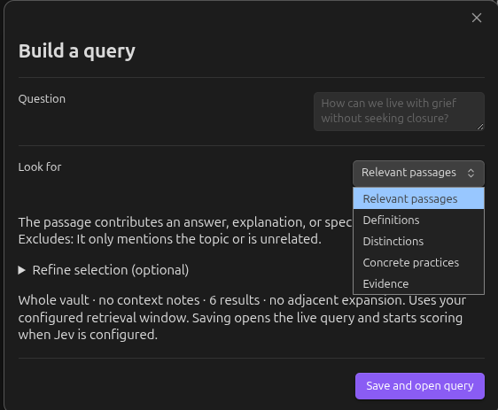
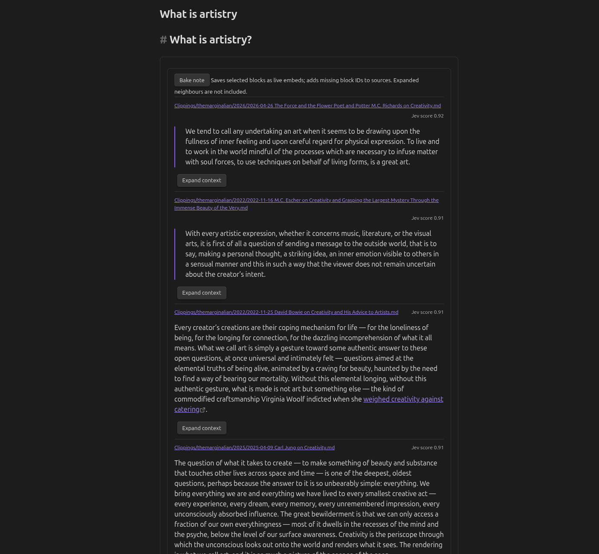
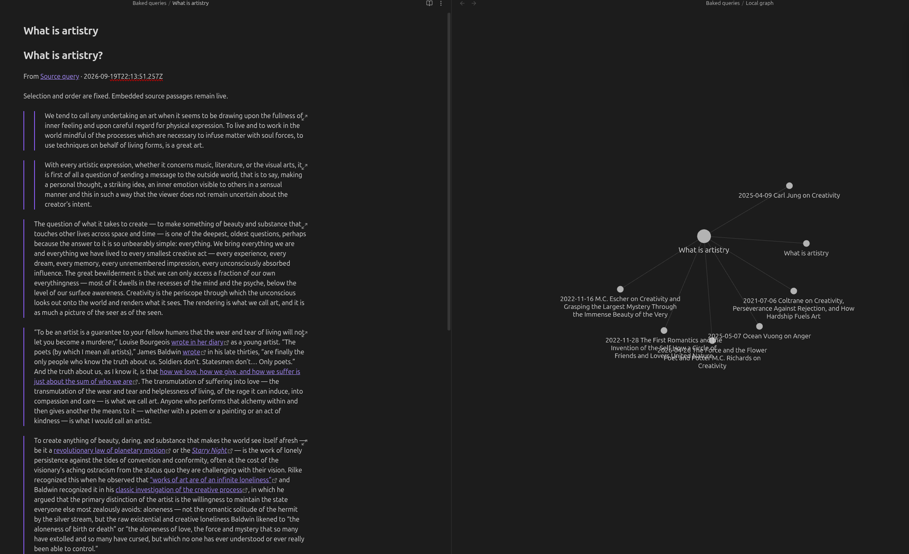

# Qualitative Query

**Ask your vault a question. Connect the passages that answer it.**

Qualitative Query finds answers in your existing notes. It shows original passages, without generating an answer.

1. **Ask.** Save a question. Local search finds possible matches, and Jev checks which passages answer it.
2. **Read.** Open each source or show nearby text. Results update as your notes change.
3. **Connect.** Select **Save passages** to create a note with source-linked passages. Backlinks connect the source notes to your selection.

## See it work

Ask a question, read matching passages, then save a note that connects their sources.
These screenshots show an earlier version. “Build a query” is now “Ask your vault”; “Bake note” is now “Save passages”.







## Start with a question

1. Enable the plugin, then open its settings.
2. To find related wording, select **Download search model**. This downloads about 31 MB once.
3. To check which passages answer your question, add a **Jev API key** from TypeSafe.
4. Run **Qualitative Query: Ask your vault** from the command palette or search icon in the ribbon.
5. Enter a question, choose a preset, and select **Save question and search**.

For example: **What is artistry?** with **Relevant passages**, or **How does solitude differ from loneliness?** with **Distinctions**.

Without a key, results are labelled **Local match**. Without the embedding download, keyword retrieval still works.

The builder saves a Markdown note in `Queries`. You can also write a query directly:

````markdown
```qualitative-query
question: How does solitude differ from loneliness?
mode: generic
instructions: Select passages that explain the distinction.
true: It contrasts solitude with loneliness or demonstrates the difference.
false: It only mentions either topic.
limit: 6
threshold: 0.5
adjacent: 0
```
````

## Connect the passages

After scoring finishes, select **Save passages**. The plugin creates a new note in `Baked queries`.

Saving passages adds missing block IDs to source notes and waits for Obsidian to index them.
It preserves existing IDs and never overwrites an earlier selection.
Open a source note's Backlinks pane to return to the saved selection.

The score is a selection aid, not proof of relevance. Read the passages before saving them.

## Settings

| Setting | Purpose |
| --- | --- |
| Jev API key | Lets Jev check passages. Stored in Obsidian secret storage. |
| Search by meaning | Finds related wording with an optional local model. |
| Questions folder | Holds saved questions; default `Queries`. |
| Passages to check | Maximum shortlisted passages before overlap removal. Default: 1,000. |
| Passages to show | Maximum results. The question builder uses six. |
| Minimum Jev score | Cutoff for matching passages. The question builder uses 0.5. |
| Skip folders | Comma-separated folders to leave out of retrieval. |

Saved questions, saved selections, and the vault configuration folder are excluded automatically.

## Privacy, accounts, and costs

Jev scoring requires a [TypeSafe account and API key](https://console.typesafe.ai/login). API use may incur charges under your plan.
The plugin sends the question, candidate passages with headings, and explicitly selected context notes to `api.typesafe.ai`.
See [TypeSafe's privacy policy](https://typesafe.ai/legal/privacy-policy) for service-side data handling.

Embeddings run locally. The explicit model download contacts Hugging Face and sends no vault text or Jev key.
The worker code ships inside the plugin; no executable code is downloaded.
To search across your vault, the plugin lists its files and reads Markdown notes outside your excluded folders.
The plugin adds no telemetry. Its runtime reads vault files and stores scores in Obsidian's local IndexedDB storage.

## Installation and compatibility

Requires **Obsidian 1.11.4 or newer**. Community-directory submission is pending; this is not yet advertised as listed.

For manual installation, download `main.js`, `manifest.json`, and `styles.css` from a [release](https://github.com/micahchoo/qualitative-query/releases).
Place them in `<vault-config>/plugins/qualitative-query/`, then reload Obsidian and enable the plugin.
The configuration folder is usually `.obsidian`. The optional release ZIP includes the embedding model for offline setup.

Desktop testing covers the main question and passage-saving flows. Mobile testing remains outstanding.

## More

- [User guide](docs/guide.md): explicit context, ordering, cache behavior, and troubleshooting.
- [Review pipeline](docs/PIPELINE.md): assess selections and check their source connections.
- [Testing status](docs/TESTING.md): completed checks and remaining manual checks.
- [Deployment](docs/DEPLOY.md): build, release, and community-directory submission.

## Development and licence

```sh
npm ci
npm run download:embeddings
npm run release:verify
```

Node.js 22 and Python 3 are required for release packaging. Tests use mocked Jev transport; no API key is required.

Code is [MIT](LICENSE). Model and tokenizer notices are in [NOTICE](NOTICE).
Your vault content retains its own rights and is not included in plugin releases.
